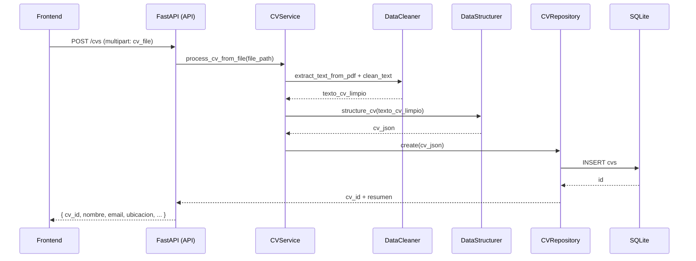
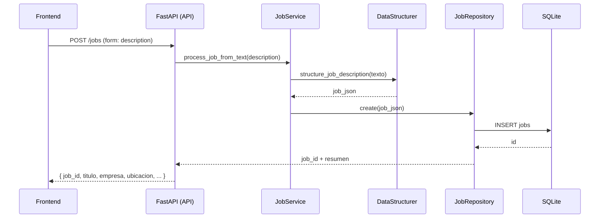
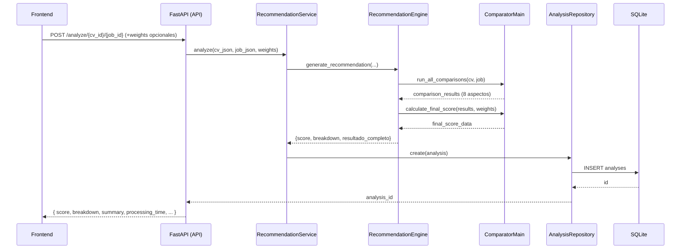
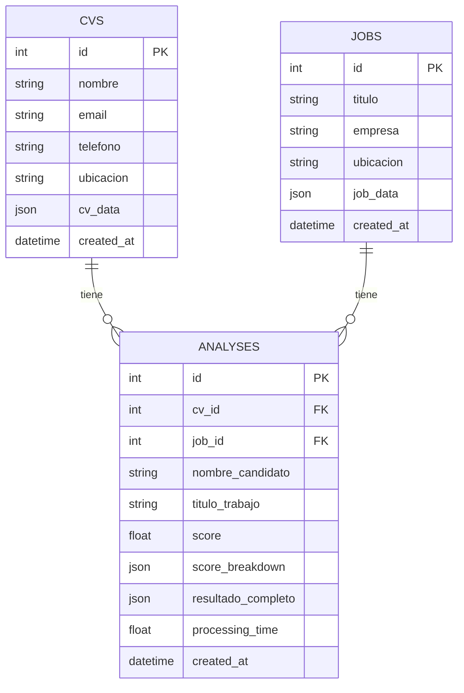

# Diagramas (Mermaid) - Tesis

Nota: Estos son diagramas en Mermaid listos para copiar a Lucidchart (o similar) y embellecer.

## 1) Arquitectura por capas (componentes)

```mermaid
graph LR
  subgraph Frontend
    FE[React/Vite/Tailwind]
  end

  subgraph Backend[Backend (FastAPI)]
    API[API - api/main.py]
    SVC[Services - api/services.py]
    REPO[Repositories - api/repositories.py]
    DB[(SQLite - cv_system.db)]

    subgraph Core[Core]
      ENG[RecommendationEngine - main/recommendation_engine.py]
      CM[ComparatorMain - algoritmo_recomendacion/comparator_main.py]
      TECH[technical_skills]
      EXP[experience]
      EDU[education]
      RESP[responsibilities]
      CERT[certifications]
      SOFT[soft_skills]
      LANG[languages]
      LOC[location]
    end
  end

  FE -->|HTTP| API
  API --> SVC
  SVC --> REPO
  REPO --> DB

  SVC --> ENG
  ENG --> CM
  CM --> TECH
  CM --> EXP
  CM --> EDU
  CM --> RESP
  CM --> CERT
  CM --> SOFT
  CM --> LANG
  CM --> LOC
```

## 2) Secuencia: Subir CV (POST /cvs)



## 3) Secuencia: Crear Job (POST /jobs)



## 4) Secuencia: Analizar CV vs Job (POST /analyze/{cv_id}/{job_id})



## 5) Dataflow del pipeline (NLP)

```mermaid
flowchart LR
  CVPDF[CV PDF] --> EXTR[Extracción texto (PyMuPDF)]
  EXTR --> CLEAN[Limpieza/normalización]
  CLEAN --> STRCV[Estructuración CV (LLM prompts)]
  STRCV --> CVJSON[CV JSON] --> DB[(SQLite)]

  JOBTXT[Job Texto] --> STRJOB[Estructuración Job (LLM prompts)]
  STRJOB --> JOBJSON[Job JSON] --> DB
```

## 6) Modelo de datos (ER)



## 7) Flujo de cálculo del score

```mermaid
flowchart LR
  RSLTS[Resultados por aspecto] --> FILT[Ignorar aspectos con score -1.0]
  FILT --> WEI[Aplicar pesos por defecto]
  WEI --> SUM[Sumar contribuciones]
  SUM --> NORM[Normalizar por pesos usados]
  NORM --> OUT{Score final (0-1)}
  RSLTS --> BR[Construir breakdown (score, weight, contribution, ignored)]
  BR --> OUT
```

## 8) Despliegue (desarrollo)

```mermaid
graph TD
  B[Browser] --> FE[Frontend (Vite/React)]
  FE -->|HTTP| API[Uvicorn + FastAPI]
  API --> DB[(SQLite)]

  %% Futuro/Producción (opcional)
  subgraph Opcional Futuro
    N[Nginx/Proxy] --> APP[FastAPI ASGI workers]
    APP --> PG[(PostgreSQL)]
  end
```

## 9) Actividad: Protocolo de evaluación

```mermaid
flowchart LR
  A[CVs PDF + Jobs Texto] --> B[Estructuración CV/Job (LLM)]
  B --> C[Validación manual por rubro 0-100]
  A -->|selección| D[Evaluación del modelo (RR.HH.)]
  D --> E[4 análisis × 5 CVs]
  E --> F[Calificación 0-100: score del sistema]
  E --> G[Calificación 0-100: razones por aspecto]
  E --> H[Comparación cualitativa de rankings]
```

## 10) Mapa de endpoints (resumen)

```mermaid
flowchart LR
  subgraph CVs
    C1[POST /cvs]
    C2[GET /cvs]
    C3[GET /cvs/{id}]
    C4[DELETE /cvs/{id}]
    C5[GET /cvs/search/{nombre}]
    C6[GET /cvs/{id}/analyses]
  end

  subgraph Jobs
    J1[POST /jobs]
    J2[GET /jobs]
    J3[GET /jobs/{id}]
    J4[DELETE /jobs/{id}]
    J5[GET /jobs/search/{titulo}]
    J6[GET /jobs/{id}/analyses]
    J7[GET /jobs/{id}/top-candidatos]
  end

  subgraph Analyses & Stats
    A1[POST /analyze/{cv_id}/{job_id}]
    A2[GET /analyses]
    A3[GET /analyses/{id}]
    A4[DELETE /analyses/{id}]
    S1[GET /stats]
    H1[GET /health]
  end
```


